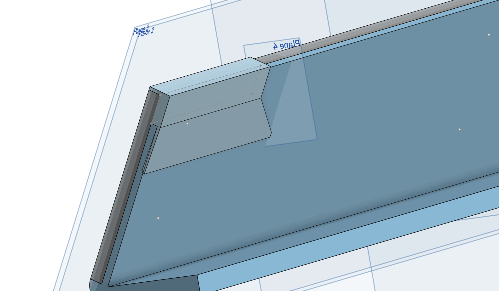

# Project Nameplate

Client work for Webb admissions team.

Task was to create 1x2x8 desktop nameplate. Potential media included 3D printing and laser cutting.

I worked mostly in designing for the 3D printer; my stand design was used alongside a laser cut plate.

Learned to use new 3D printer with better features, and basics and limitations of laser cutting. Lots of extra practice with CAD in Onshape. Learned to import and deal with vector art (SVGs) as DXFs in CAD programs and the inherent limitations of each.

.jpg)
