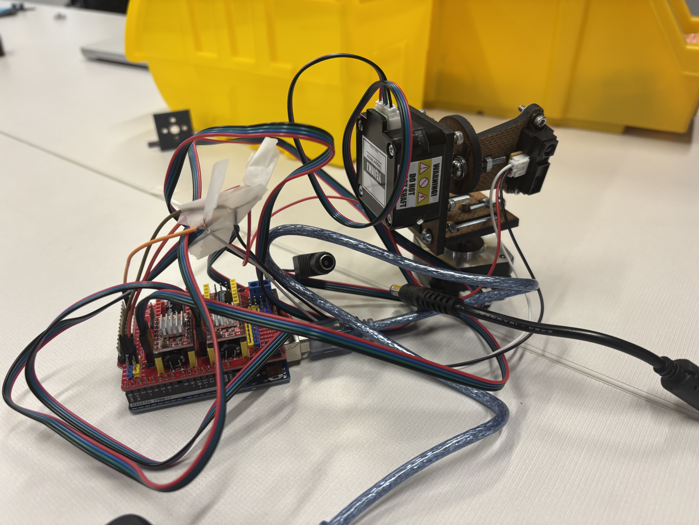
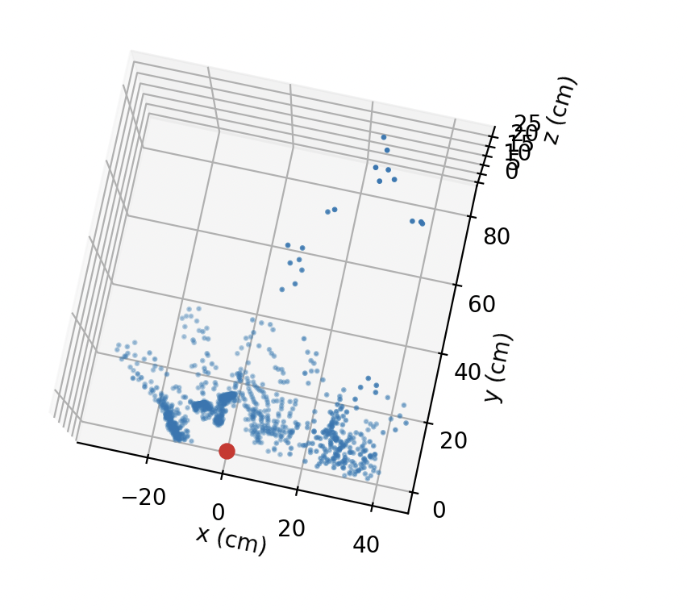
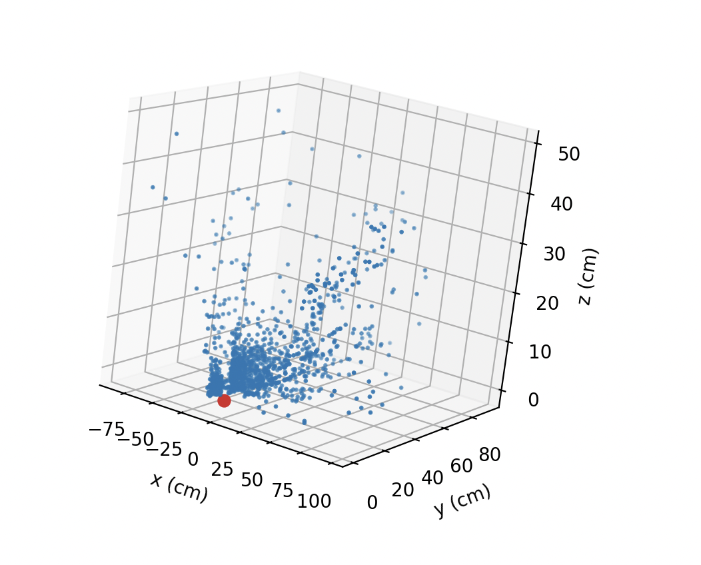
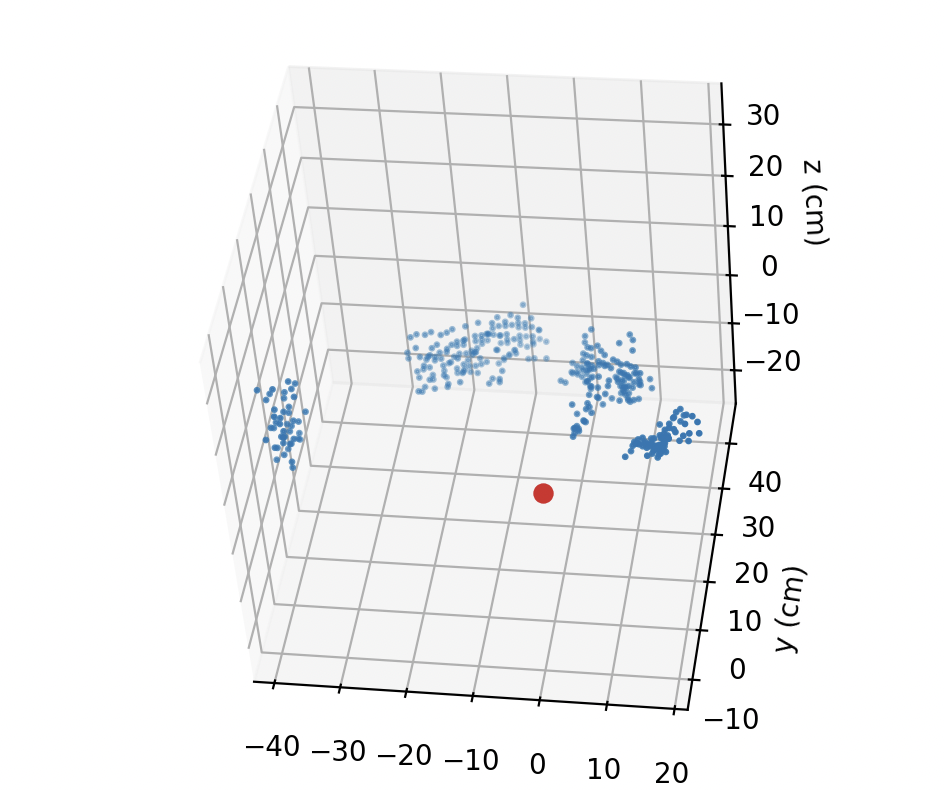

# 3D Scanner Planning Document

This is a planning document/journal for the 3D scanner project.

## Getting the scanner to work

We use a SHARP GP2Y0A21YK0F IR distance sensor. [Datasheet](https://global.sharp/products/device/lineup/data/pdf/datasheet/gp2y0a21yk_e.pdf).

These have an effective range of 10-80 cm which is good for our purposes. Error in measurement is not mentioned officially but usually cited in the order of magnitude of single centimetres. 

### Parts


### Circuit Layout


### Code
This code reads the raw voltage value, converts it to a distance, and sends it to serial.

_This code was generated by AI_

```cpp
void setup() {
    Serial.begin(9600);
}

float computeDistance(float voltage) {
    return pow( voltage / 15.80314 , 1.0 / -0.836479 );
}

void loop() {
    int raw = analogRead(A1);                     // 0–1023
    float voltage = raw * (5.0 / 1023.0);         // convert to volts
    float distance = computeDistance(voltage);

    Serial.println(distance, 2);                  // cm, 2 dp
    delay(100);
}
```

This is code used for validation or calibration purposes. Every time an input distance is entered the program displays that distance alongside the calculated measured distance and voltage. It reuses `computeDistance` from the above snippet. The function used to convert voltage to distance is an exponential function obtained by exponential regression on points from a relevant graph on the datasheet. Ideally one would calibrate said exponential function with a simple testing setup but this would take too much time.

_This code was generated by AI_

```cpp
void setup() {
    Serial.begin(9600);
    while (!Serial) {}

    // CSV header for saving to file
    Serial.println("actual_cm,raw_adc,computed_cm");

    Serial.println("Enter actual distance in cm:");
}

float computeDistance(int raw) {
    // convert ADC value (0–1023) to volts
    float voltage = raw * (5.0 / 1023.0);

    // your fitted curve
    float d = 15.80314 * pow(voltage, -0.836479);

    return d;
}

void loop() {
    static String buf = "";

    while (Serial.available() > 0) {
        char c = Serial.read();

        if (c == '\n') {
            float actual = buf.toFloat();

            // take sensor reading
            int raw = analogRead(A1);
            float measured = computeDistance(raw);

            // CSV line for logging
            Serial.print(actual, 2);
            Serial.print(",");
            Serial.print(raw);
            Serial.print(",");
            Serial.println(measured, 2);

            Serial.println("Enter next actual distance:");
            buf = "";
        }
        else if (c != '\r') {
            buf += c;
        }
    }
}
```

## Moving the sensor

A sensor in place does not do much. To create a functioning 3D scanner one must either move the scanner or the space/object being scanned. Three options were considered:

 - A turret mechanism to move the sensor in pitch and yaw to scan a scene in front of the sensor.
 - A dropping turntable that would allow the sensor to capture 360-degree slices of an object on the turntable.
 - Strap the sensor onto a 6-DOF inertial measurement unit.

Option 3 was quickly dismissed for lack of resources. Between option 1 and 2, option 1 was probably the easier one to implement and more importantly took up a lower volume, so it was considered first.

### Moving the stepper

The stepper interfaces with the arduino via a [CNC Shield from Makerstore](https://www.makerstore.com.au/wp-content/uploads/filebase/publications/CNC-Shield-Guide-v1.0.pdf) and a [A4988 Stepper Driver](https://makerstore.cc/product/stepper-motor-driver-a4988/). These were connected in a standard manner with 1/16 microstepping configured. 

### Mechanical connection

To convert motor movements into yaw and pitch would essentially require two L-brackets, one motor to motor and one motor to scanner. These were initially 3D printed but laser cutting was eventually preferred due to faster production and iteration speed. The final laser-cut design, cut on MDF board, involved a lot of captured nuts to hold both the bracket together and also in place of a stepper hub. The drawing of half of the motor to motor bracket that includes the "motor hub" is shown below.


## Integration into Product

There was less of an emphasis on creating a "nice" product and the focus was more in getting the sensor to move, take readings, and display its outputs correctly.

### Wiring

A full setup is shown below. This involves 4 total laser-cut parts.



As is pretty obvious the connections are taped and not done in a very sophisticated or robust way. No wire organisation was ever considered. The sensor was plugged into the CNC shield. 

### Code

See [https://github.com/PatrickJYKang/3d-scanner](https://github.com/PatrickJYKang/3d-scanner). The .ino script runs the steppers and sensor: the base stepper turns through 180 degrees in which the sensor takes a measurement every step and the arduino sends this value along with the inferred position values of the steppers through serial. The python script then takes these values and using polar coordinates converts them to 3D Cartesian coordinates, which are plotted using `matplotlib`.

### Results

These objects were scanned (not necessarily in this configuration)


An example screenshot of the results is shown below.



In general, the setup is good at identifying flat and perpendicular surfaces, but struggles with curved or slanted/tilted surfaces. It is also capable of rather precisely tracing holes in objects, as shown in the below example.



That said, the most prominent issue affecting these readings seems to be stray points going in all directions especially at edge of objects. This is a common issue known as "flying pixels". Generally these are mitigated through post-processing software fixes. Surprisingly, these "flying pixels" can reach multiple tens of centimetres away from the object scanned, which is not typical.

### Post-processing

To address above issues post-processing was implemented in two steps:

1. **Hard distance filter:** drops any points outside of 80 cm (the effective range of the sensor).
2. **Neighbours filter:** for each point, program looks for points in a 3D radius defined by `--neighbor-radius-cm`, default 3 (cm). If it has fewer than `N` neighbours, as defined by `--neighbor-min-neighbors` (default 4), point is dropped at end of iteration. Repeats for `--neighbor-iterations` iterations, default 2.

Example of post-processed point cloud:



The strange protrusion is as a result of an object containing a hole. Previously the setup worked well with holes, but in this case this was likely to to environmental factors.

## Reflections

A personal reflection on this project:

### Technical

A list of things to consider in future when working with similar components or for replication of this project:

 - Isolate every single source of error: for example, on a the stepper motors, those may be faulty code, a faulty CNC shield, a faulty stepper driver, a faulty power supply, or a faulty stepper.
 - Microstepping is easy, so get it implemented before thinking about other issues that would immediately become irrelevant.
 - It is more important to get the whole chain of components and data fully set up before iterating for quality.
 - Laser cutting is usually superior to 3D printing in speed, costs, and durability in certain areas, but becomes complex outside of flat plates.
 - It is preferred not to use too many stock components that may be replicated natively, motor hubs for example.
 - Expect your raw data to be a mess, find something from that mess with eyes, if that makes sense, then clean up mess with software, if not, something is probably either not connected or otherwise faulty.

### Personal

I got to know the infrastructure around arduinos and such electronics a lot better. I have worked with arduinos on a very basic level but never more than a blinking LED or something simple closed-loop LED switch off of a YouTube video; in any case, my technical situational awareness around arduinos has increased. As a more software inclined person I learned to work with some of the oddities and practical inconveniences of hardware and electronics. I also learned how to read things from seemingly useless or messy data and come up with ways to clean that up. In general, the more this project moved along, the less I was inclined to clean up the mess, and instead I focused on actually getting something to work, then dealing with the mess. This does not just apply to the final data processing; other examples include wire organisation (we gave up), calibrating the sensor (originally one of the top priorities but was left behind), human written human readable code (all code was written by AI), a nice package for the "product" (everything was left exposed), all the other nicer options that we didn't get to (turntables, etc.), and actually correct maths (our maths did not take into account the size of the setup itself). 

Sentimentally as a group we were always a bit too eagerly or confidently focused on the next step, perhaps often getting ahead of ourselves too much. This led to a lot of back and forth in getting things that were not fully set up do do the next thing which it was not prepared for. This only started to slow down perhaps after Thanksgiving break when the time pressure was somewhat lifted (original target was working sensor by Thanksgiving). More progress was probably made since then than before. It was, in any case, a very positive environment to work in.

## Resources

(Not) everything it took to complete this project. Electronics, as well as human resources.

### Components

 - Motor-to-motor L-bracket, motor-to-sensor L-bracket
 - M4 screws and nuts (primarily)
 - [Arduino Uno](https://store-usa.arduino.cc/products/arduino-uno-rev3)
 - [SHARP GP2Y0A21YK0F sensor](https://global.sharp/products/device/lineup/data/pdf/datasheet/gp2y0a21yk_e.pdf)
 - [A4988 Stepper Driver](https://makerstore.cc/product/stepper-motor-driver-a4988/)
 - [CNC Shield](https://www.makerstore.com.au/wp-content/uploads/filebase/publications/CNC-Shield-Guide-v1.0.pdf)
 - [NEMA 17 Steppers](https://www.omc-stepperonline.com/nema-17-stepper-motor)
 - Jumper wires
 - Laptop with USB-A serial, running Arduino IDE and python.

### People

This is not an exhaustive list but some highlights:

 - Mr. Raus, provided much technical knowledge, sensibility, L-bracket design ideas, and [https://github.com/luke-raus/3d-scanner](https://github.com/luke-raus/3d-scanner)
 - Dr. Dzula, provided a wealth of library (and non-library) resources, motivation, and help with this journal.
 - Thomas did lots of arduino-to-stepper work that we largely based our setup off of. See his great documentation at [https://www.pigtt.com/](https://www.pigtt.com/).
 - Harry came up with the ball turret idea that first got our sensor moving.
 - Charley, also contributed great technical knowledge, and designed part of the L-bracket.
